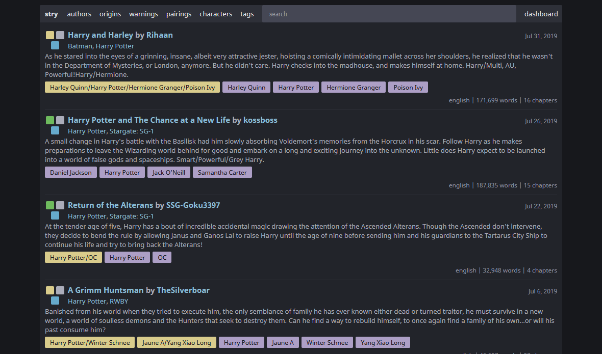

<div>
  <p align="center">
    
    <h3 align="center">stry</h3>
    <div align="center">
      <strong>A mini self-hosted Archive of Our Own, or a story host with tagging.</strong>
    </div>
    <p align="center">
      <a href="https://github.com/teammycelium/myriad/blob/master/LICENSE">View Demo</a>
      ·
      <a href="https://github.com/teammycelium/myriad/blob/master/LICENSE">Report Bug</a>
      ·
      <a href="https://github.com/teammycelium/myriad/blob/master/LICENSE">Request Feature</a>
    </p>
    <div align="center">
      
      <a href="https://github.com/teammycelium/myriad/blob/master/LICENSE">
        
      </a>
    </div>
    <div align="center">
      <a href="">
        
      </a>
    </div>
  </p>
</div>

## Table of Contents

  - [Features](#features)
  - [Requirements](#requirements)
  - [Building](#building)
    - [Supported Platforms](#supported-platforms)
    - [With Bundled Libraries](#with-bundled-libraries)
    - [With System Libraries](#with-system-libraries)
  - [Usage](#usage)
    - [Command Line](#command-line)
    - [Config](#config)
  - [Built With](#built-with)
  - [Contributing](#contributing)
  - [License](#license)
  - [Acknowledgements](#acknowledgements)



## Features

  - Tagging system
  - Search
  - Importer from various sites
    - Built upon [story-dl](https://gitlab.com/Txuritan/story-dl)
  - Single user only, made for the phone and Raspberry Pi
  - Keyboard controls (*WIP*)

## Requirements

  - Rust
  - [`cargo-make`](https://github.com/sagiegurari/cargo-make)
  - C/C++ compiler
  - Optionally:
    - [`cross`](https://github.com/rust-embedded/cross) (If you are cross-compiling)
    - cURL
    - OpenSSL
    - SQLite

## Building

### Supported Platforms

`stry` support multiple different platforms through use of [`cross`](https://github.com/rust-embedded/cross) and native compilation.

This is a list of platforms that `stry` should be able to ran on.
If you managed to get it running on a unlisted platform, either let me know or submit a pull-request.

  - AArch64
    - Samsung S7
  - ARMv7
    - Raspberry Pi 3 B+
  - Linux x64
    - Not Yet Tested
  - MacOSX
    - Not Yet Tested
  - Windows x64

**NOTE**: `stry` is primarily developed on a Windows machine so some platforms may not be tested.

### With Bundled Libraries

To build `stry` using the bundled/static libraries is just a simple build command:

```
cargo make build-<PLATFORM>
```

### With System Libraries

`stry` by default uses bundled/static versions of `cURL`, `OpenSSL`, and `SQLite`.
While a bad idea generally, it does this to allow for easier building on the `AArch64`, `ARMv7`, and `Windows` targets.

To build `stry` without bundling you have to disable the default features:

```
cargo make build-<PLATFORM> --no-default-features
```

## Usage

`stry` can be controlled by command line argument and/or a config file.
The config options can be overridden by command line arguments, which allows you to quickly test features without editing a file.

### Command Line

Most config file options can be controlled with command line argument but not all of them.
This would be due to either not being implemented (yet), not being fully implemented, or I haven't figured out a way to implement them (yet).

See the `stry --help` for all options as it is undergoing work, and could change at any time.

### Config

`stry`'s config file is written in `RON` or [`Rusty Object Notation`](https://github.com/ron-rs/ron) which is similar in structure to normal JSON.
Have a look at is page as it may confuse you quite a bit.

By default `stry` will try to read its config (`stry.ron`) from the current directory, if it can't be found it will fallback onto its default built-in config.
In the future `stry` will look for its config the normal UNIX and Windows config paths.

Have a look at `stry.ron.example` which shows the default built-in config along with comments describing parts of it.

## Built With

`stry`, being written in Rust, uses a number of libraries from other developers.
A list can be found in the `Cargo.toml` file but some notable libraries include:

  - The [Tokio](https://github.com/tokio-rs) team's async runtime [Tokio](https://github.com/tokio-rs/tokio) and application level tracing [Tracing](https://github.com/tokio-rs/tracing)
  - [Sean McArthur](https://github.com/seanmonstar)'s async web server [Warp](https://github.com/seanmonstar/warp)
  - [Dirkjan Ochtman](https://github.com/djc)'s compile time template engine [Askama](https://github.com/djc/askama)
  - [John Gallagher](https://github.com/jgallagher)'s SQLite3 bindings [Rusqlite](https://github.com/jgallagher/rusqlite)
  - [Steven Fackler](https://github.com/sfackler/rust-postgres)'s native PostgreSQL driver [Rust-Postgres](https://github.com/sfackler/rust-postgres)

Non managed, but bundled, libraries include:

  - [Jeroen Akkerman](https://github.com/Ionaru)'s markdown editor [EasyMDE](https://github.com/Ionaru/easy-markdown-editor)
  - [Craig Campbell](https://github.com/ccampbell)'s keyboard shortcut handler [Mousetrap](https://github.com/ccampbell/mousetrap)
  - [yairEO](https://github.com/yairEO)'s tag input [Tagify](https://github.com/yairEO/tagify)
  - [Font Awesome](https://fontawesome.com/), required by [EasyMDE](https://github.com/Ionaru/easy-markdown-editor)

## Contributing

## License

This project is licensed under the MIT License - see the [LICENSE](./LICENSE) file for details.

## Acknowledgements

Thanks to [Archive of Our Own](https://archiveofourown.org/) for being a great inspiration for most of this project, along with being a goal to work towards.
